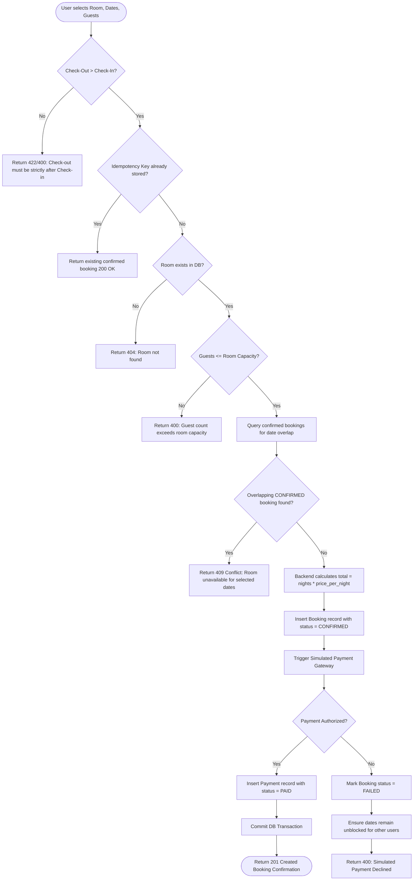
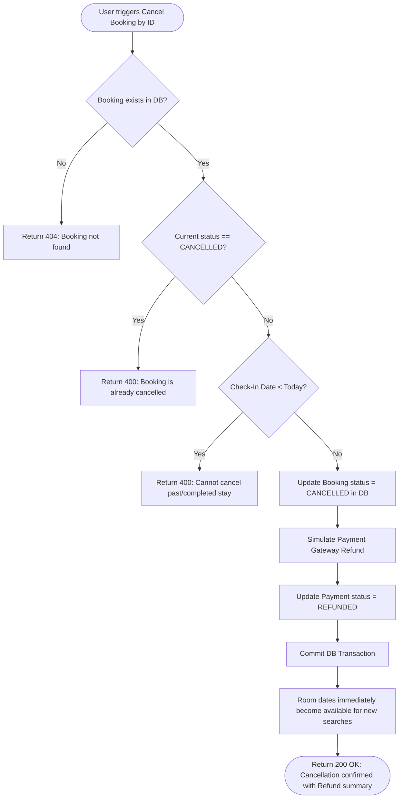

# Low-Level Design (LLD): Booking & Cancellation Flowcharts

## 1. Booking Creation Workflow

```mermaid
flowchart TD
    Start([User selects Room, Dates, Guests]) --> ValDates{Check-Out > Check-In?}
    ValDates -- No --> ErrDate[Return 422/400: Check-out must be strictly after Check-in]
    ValDates -- Yes --> CheckIdemp{Idempotency Key already stored?}
    
    CheckIdemp -- Yes --> ReturnExisting[Return existing confirmed booking 200 OK]
    CheckIdemp -- No --> CheckRoom{Room exists in DB?}
    
    CheckRoom -- No --> ErrRoom[Return 404: Room not found]
    CheckRoom -- Yes --> CheckCap{Guests <= Room Capacity?}
    
    CheckCap -- No --> ErrCap[Return 400: Guest count exceeds room capacity]
    CheckCap -- Yes --> QueryOverlap[Query confirmed bookings for date overlap]
    
    QueryOverlap --> OverlapFound{Overlapping CONFIRMED booking found?}
    OverlapFound -- Yes --> ErrConflict[Return 409 Conflict: Room unavailable for selected dates]
    OverlapFound -- No --> CalcPrice[Backend calculates total = nights * price_per_night]
    
    CalcPrice --> CreateRecord[Insert Booking record with status = CONFIRMED]
    CreateRecord --> ProcessPay[Trigger Simulated Payment Gateway]
    
    ProcessPay --> PaySuccess{Payment Authorized?}
    PaySuccess -- Yes --> RecordPaid[Insert Payment record with status = PAID]
    RecordPaid --> CommitTx[Commit DB Transaction]
    CommitTx --> BookingDone([Return 201 Created Booking Confirmation])
    
    PaySuccess -- No --> MarkFailed[Mark Booking status = FAILED]
    MarkFailed --> ReleaseRoom[Ensure dates remain unblocked for other users]
    ReleaseRoom --> ErrPay[Return 400: Simulated Payment Declined]
```

---

## 2. Cancellation Workflow

```mermaid
flowchart TD
    StartCancel([User triggers Cancel Booking by ID]) --> FetchBkg{Booking exists in DB?}
    FetchBkg -- No --> ErrNotFound[Return 404: Booking not found]
    FetchBkg -- Yes --> CheckStatus{Current status == CANCELLED?}
    
    CheckStatus -- Yes --> ErrAlreadyCanc[Return 400: Booking is already cancelled]
    CheckStatus -- No --> CheckDate{Check-In Date < Today?}
    
    CheckDate -- Yes --> ErrPastDate[Return 400: Cannot cancel past/completed stay]
    CheckDate -- No --> UpdateStatus[Update Booking status = CANCELLED in DB]
    
    UpdateStatus --> SimRefund[Simulate Payment Gateway Refund]
    SimRefund --> UpdatePay[Update Payment status = REFUNDED]
    UpdatePay --> CommitTx[Commit DB Transaction]
    CommitTx --> ReleasedInfo[Room dates immediately become available for new searches]
    ReleasedInfo --> FinishCancel([Return 200 OK: Cancellation confirmed with Refund summary])
```
